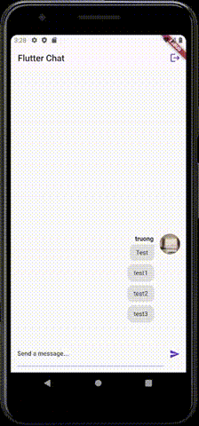

# Chat App
The group chat application allows users to login and register and chat with each other

## About
1. Authenticate users through Firebase Authentication
2. Send user data to Firebase
3. Use Firebase utilities (Authentication,Storage,Firestore Database,Messaging)
4. Use push notification

## Feature
1. Login,Sign Up
2. Upload image
3. Chat between users
4. New message notification
