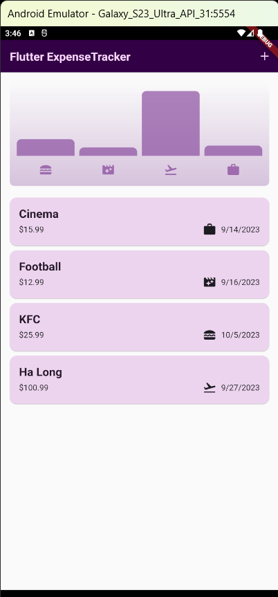
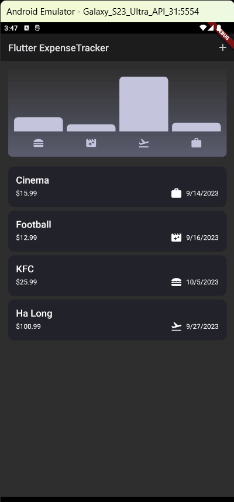
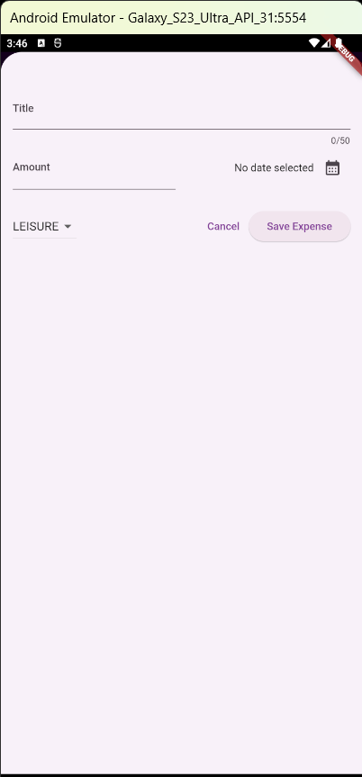
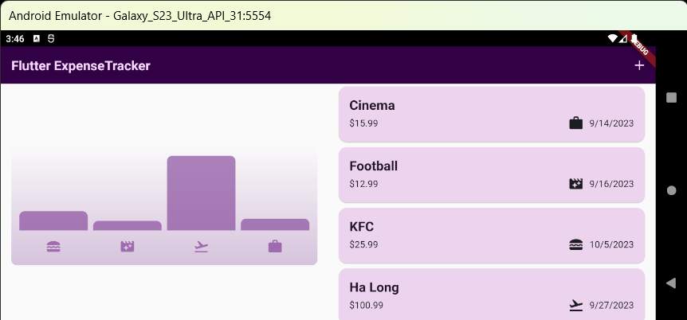

# Expense Tracker App
The mobile app helps users manage and record personal activities and expenses over time

  

## About
1. Using Modals, Dialogs & More
2. Basic User Input Handling
3. Flutter Theming(Color Scheme Customization)
4. Changing Layouts Based On Screen Sizes
5. Detecting & Using Screen and Platform Information
6. Building Adaptive Widgets

## Feature
1. Edit and undo expenses
2. Dark mode
3. Responsive design(Portrait & Landscape Mode)
4. Chart expenses

