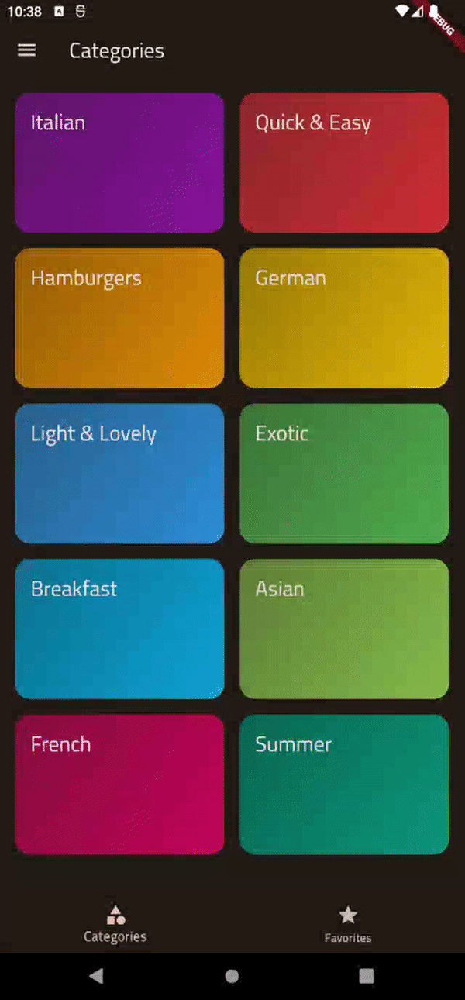

# Meals App
Meals App is designed to display food information, is a sample application to better understand how to transition screens in flutter and handle application logic

## About
1. Allowing Users To Navigate Between Screens(Navigator.push(),pop())
2. Multi-widget state management is simpler (using riverpod)
3. Adding animations(explicit,implicit animations),multi-screen transitions

## Feature
1. Displays a list of meals.
2. Details about a specific meal.
3. Ability to filter meals.
4. Choose favorite meals.
      