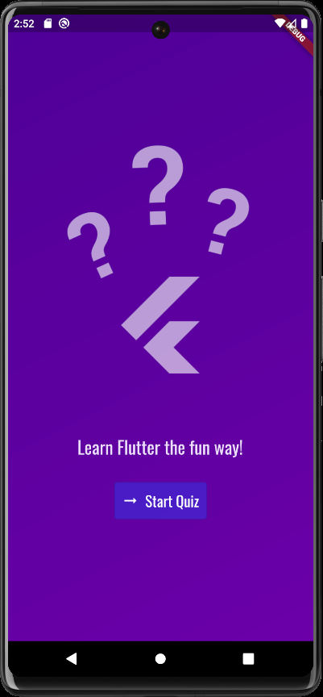
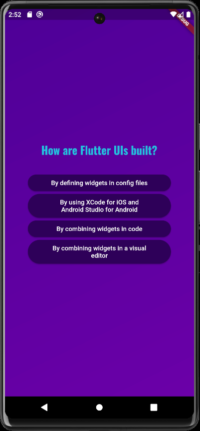
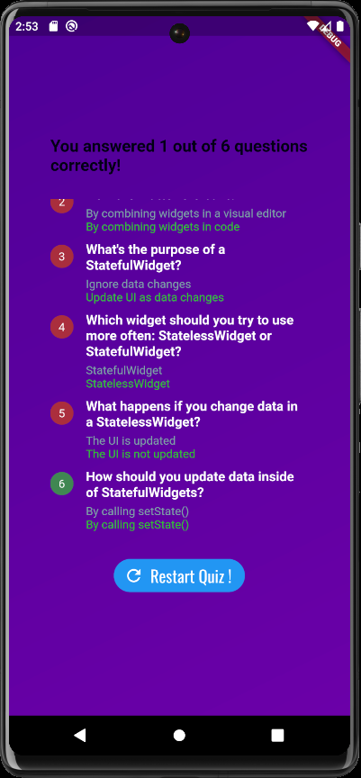

# Quiz App
The mobile application allows users to participate in multiple-choice games, where users choose answers and then display results after they complete the quiz.
  

## About
1. Explore & Use More Widgets
2. Widget lifecycle: initState,build,dispose
3. Build More Complex User Interfaces(Column,Row,SingleChildScrollView,...)
4. Render Content Conditionally & Lifting State Up