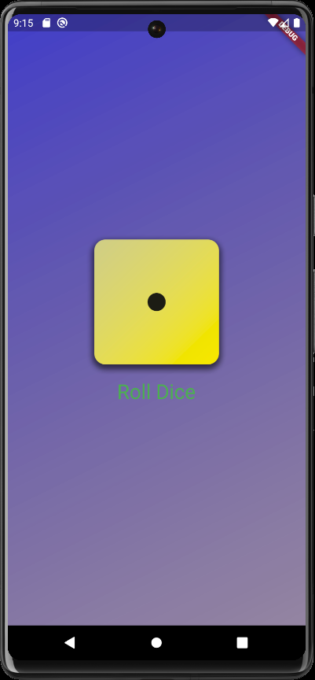
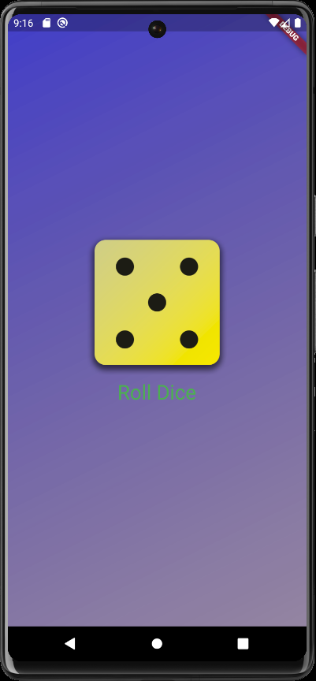

# Roll Dice App
A basic Flutter app designed to simulate random dice rolls that determine outcomes in games.
        

## About
 1. Explore Core Flutter & Dart Syntax
 2. Understanding & Writing Flutter and Dart Code
 3. Working with Flutter Widgets

