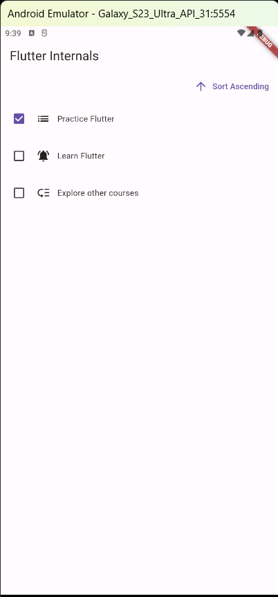
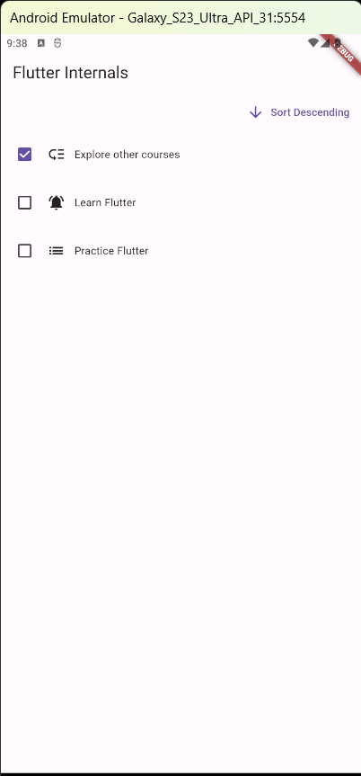
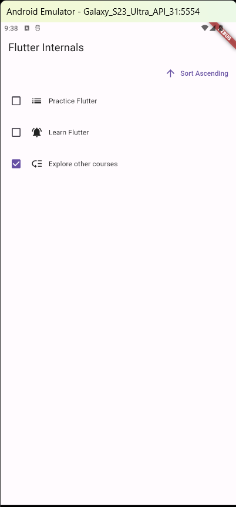

# Todo App
A simple app that helps get a better look behind the scenes, better understand the concepts:

1. Widget,Element & Render Tree
2. How Flutter Updates UIs
3. Understanding Keys  - For example, when performing sorting of Todo Items
  * In case the key is not used:  TodoItem is rearranged but State(CheckBox) does not change position
      ```
      CheckableTodoItem (  
         todo.text,  
         todo.priority,  
      ) 
      ```
     
  * In case the key is used:  TodoItem is rearranged and State(CheckBox) also changes
     ```
    CheckableTodoItem (  
        key: ObjectKey(todo),  
        todo.text,  
        todo.priority,  
    )
     ```
     
      